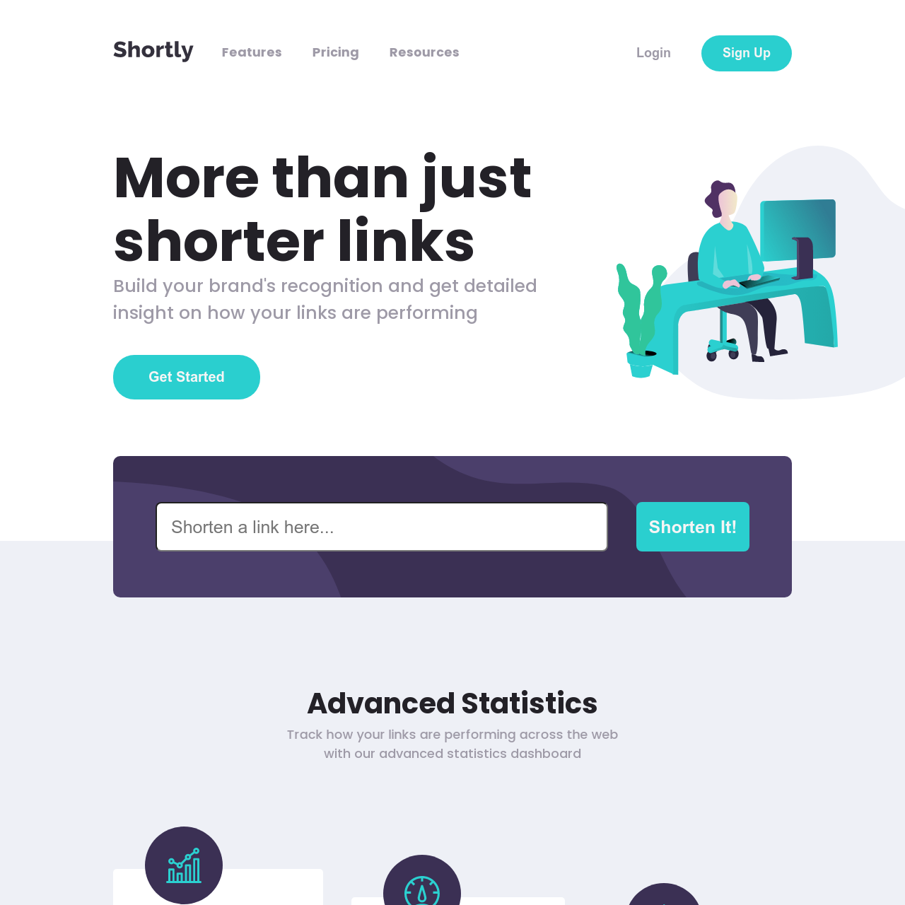

# Project Title

A one page web appliaction using https://shrtco.de/ API, to give it's users an easy way to shorten their links, and make them easier to remember or share.

## Screenshots

## Links

• Live Site URL: (https://nerginov.github.io/url-shortener/)
## Tech Stack

• HTML5

• CSS3

• SASS

• JAVASCRIPT

## Built with 

• Mobile-first workflow

• Semantic HTML5

• CSS custom properties

• Flexbox

• ECMAScript 6

## Resources
•(https://www.frontendmentor.io/) provided assets:

- JPEG design files for mobile & desktop layouts

- Style guide for fonts and colors

- Optimized image assets

•(https://developer.mozilla.org/)

•(https://stackoverflow.com/)
